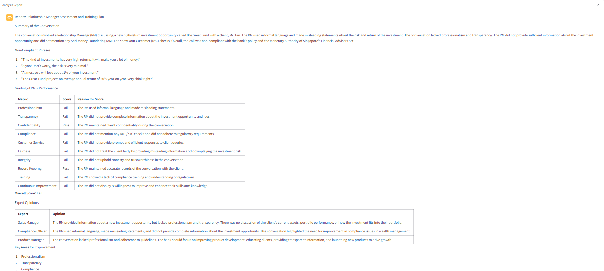
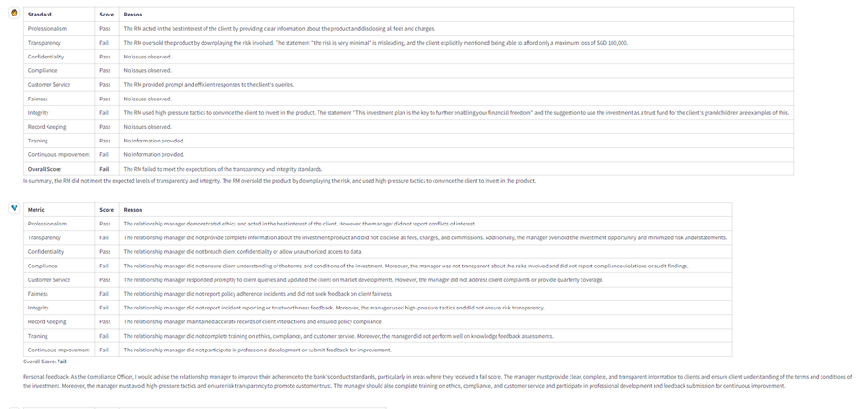
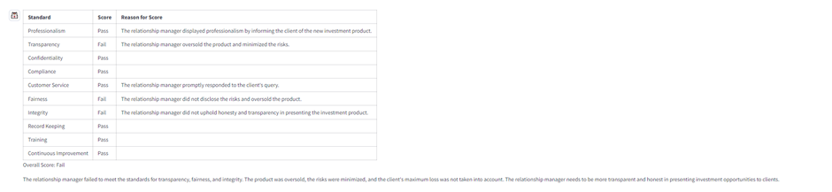
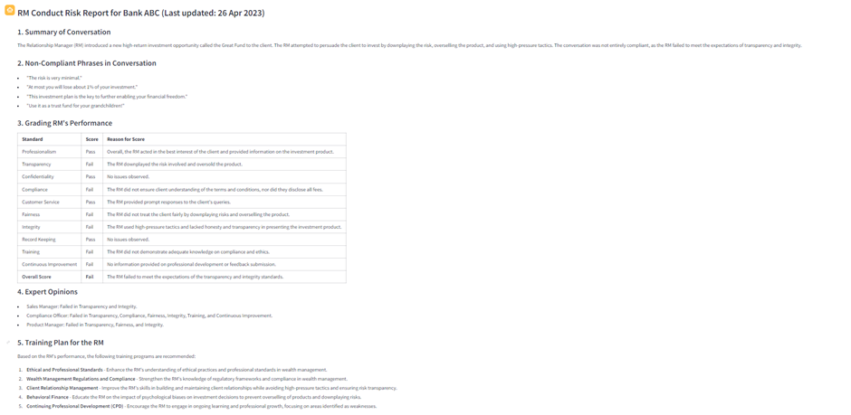
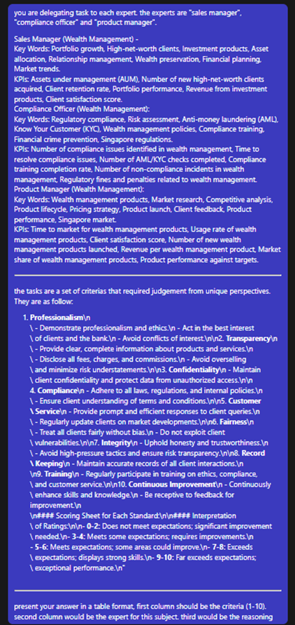
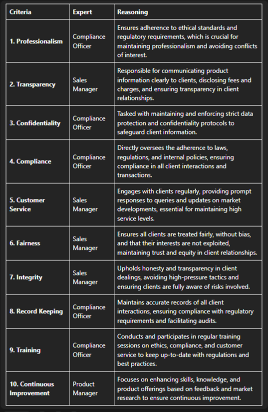
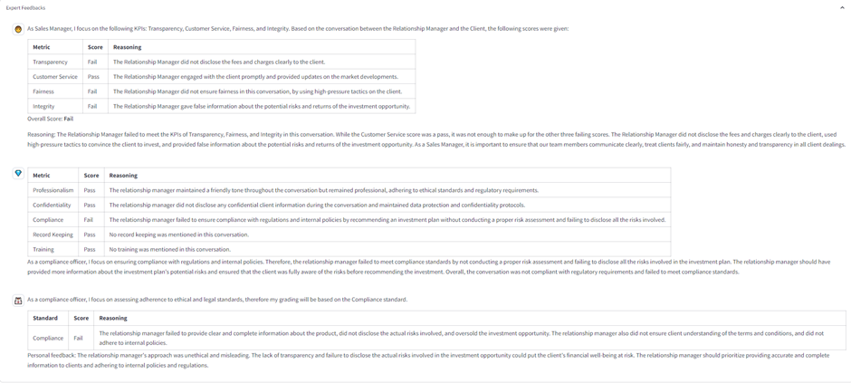

streamlit FE for compliant demo

# setup:

1. .env
```
NEXTGPT_BACKEND_PORT=<PORT NO>
NEXTGPT_API_KEY=<>
```

2. Ensure NEXTgpt backend (v1) is running and pointed to
3. Start streamlit: streamlit run main.py


V1 – Experts give their own point of view given role-specific KPIs, in paragraph format





V2 – All experts given the same metrics, consolidated into the same table




V3 – Use LLM to delegate task to each expert, and consolidate them together



V3 Final results:

